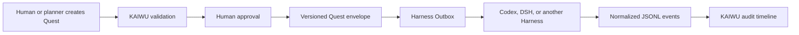

# 开物 KAIWU

> 本地优先、人工批准、跨 Agent Harness 的工作台。
>
> A local-first, human-approved workbench for coordinating multiple Agent Harnesses.

开物把项目、任务、知识来源、Harness 事件和执行 Quest 放在一个可审计的工作台中。规划可以来自人或 AI，但任何写入型 Quest 都必须经过人工批准，才会进入目标 Harness 的 Outbox。

[](https://github.com/e29denghy/kaiwu/actions/workflows/tests.yml)
[](LICENSE)

## 中文说明 | Chinese documentation

### 开物是什么

开物是一个本地优先、人工批准、跨 Agent Harness 的工作台。它负责保存项目和 Quest、记录 Harness 事件、控制人工审批、派发 Outbox 消息并保留审计历史；真正的机器执行仍由 Codex、DeepSeek Harness 或其他 Harness 完成。

### 核心工作流

```text
人或 AI 规划器创建 Quest
        ↓
开物校验 → 人工批准 → 写入 kaiwu.quest/v1 Outbox
        ↓
目标 Harness 执行 → 写入 kaiwu.event/v1 Inbox
        ↓
开物同步事件并形成审计时间线
```

写入型 Quest 没有人工批准就不能派发；重试会产生新的执行尝试，不会覆盖历史记录。

### v0.1 已包含

- Laravel 13 + Inertia 3 + Vue 3 本地工作台。
- Workspace、项目、模块、任务、步骤、提醒和每日聚焦。
- Markdown 知识来源同步。
- 幂等 JSONL Harness 事件导入和项目关联时间线。
- Quest 风险元数据、约束、验证方式和验收标准。
- 人工批准门禁、版本化 Outbox 信封和追加式重试历史。
- `harness:sync`、`quest:dispatch` 等 CLI 命令。

开物 v0.1 不执行任意 Shell 命令。Inbox 内容只被当作数据处理，不会被当作开物自身的执行指令。

### 快速开始

```bash
git clone https://github.com/e29denghy/kaiwu.git
cd kaiwu
composer install
cp .env.example .env
touch database/database.sqlite
php artisan key:generate
php artisan migrate --seed
npm install
npm run build
php artisan serve
```

打开 <http://127.0.0.1:8000>，创建 Harness 连接，并配置绝对路径的 Inbox 和 Outbox。

### Harness 连接

当前使用 `jsonl` 驱动：

- `inbox_path`：Harness 或桥接程序写入的追加式 JSONL 文件。
- `outbox_path`：开物写入已批准 Quest 信封的目录。

```bash
php artisan harness:sync
php artisan harness:sync codex-local
php artisan quest:dispatch 12 codex-local
```

协议文档：

- [Harness Adapter 协议](docs/harness-adapter.md)
- [Quest 协议](docs/quest-protocol.md)

### DeepSeek Harness（DSH）支持说明

当前 README 没有声称“开物已经原生支持 DSH”。原因是 DSH 的公开事件格式和执行接口还没有作为稳定公共协议接入开物。

开物现在提供的是通用接入边界：Harness 将执行状态、结果和错误写成 `kaiwu.event/v1` 事件进入 Inbox；开物将人工批准后的 Quest 写成 `kaiwu.quest/v1` 信封进入 Outbox。等 DSH 公开稳定协议后，只需增加一个 DSH Adapter，把 DSH 格式转换成这两种开物格式，开物的项目、人工审批和审计模型都不需要重写。

换句话说，这是“架构已经预留好接入位置”，不是“当前已经完成 DSH 原生兼容”。

### 安全边界

- 默认本地优先、单用户，不要把开发服务器暴露到公网。
- 创建 Quest 不等于授权执行。
- 批准时间、执行尝试和派发 ID 都会保留。
- 连接 JSON、Quest 文本、示例和仓库中不应放置密钥。

启用能够修改代码仓库的桥接程序前，请阅读 [SECURITY.md](SECURITY.md)。

### 路线图

1. Adapter 一致性测试夹具和 JSON Schema。
2. Codex bridge 参考实现。
3. DSH 公开协议可用后的 DSH Adapter。
4. 结果确认和差异审查 UI。
5. 认证与多用户审批策略。

---

## English documentation

## Why KAIWU

Agent Harnesses are good at execution, but teams still need one place to answer:

- What is planned, active, waiting, or completed?
- Which source or Harness produced the evidence?
- Who approved a write-capable task?
- What was dispatched, retried, cancelled, or rejected?
- Can another Harness consume the same Quest without rewriting the workbench?

KAIWU keeps those decisions outside any single Harness.

## Core workflow



The core does not pretend to know unreleased vendor APIs. Harness-specific behavior lives behind adapters; the stable boundary is the versioned Inbox/Outbox protocol.

## Included in v0.1

- Laravel 13 + Inertia 3 + Vue 3 local workbench.
- Workspaces, projects, modules, tasks, steps, reminders, and daily focus.
- Optional Markdown knowledge-source synchronization.
- Harness connections with idempotent JSONL event ingestion.
- Normalized, project-linked Harness event timeline.
- Quest creation, risk metadata, constraints, verification, and acceptance criteria.
- Mandatory human approval before dispatch.
- Atomic filesystem Outbox with `kaiwu.quest/v1` envelopes.
- Append-only execution attempts for retry history.
- CLI commands for synchronization and approved dispatch.

KAIWU does **not** execute arbitrary shell commands itself in v0.1. A Harness consumes approved Outbox messages and writes normalized events back to its Inbox. This keeps the coordinator small and prevents a web request from silently gaining machine-level execution authority.

## Requirements

- PHP 8.4+
- Composer 2
- Node.js 22+
- SQLite by default; MySQL and PostgreSQL are supported by Laravel

## Quick start

```bash
git clone https://github.com/e29denghy/kaiwu.git
cd kaiwu
composer install
cp .env.example .env
touch database/database.sqlite
php artisan key:generate
php artisan migrate --seed
npm install
npm run build
php artisan serve
```

Open <http://127.0.0.1:8000>, create a Harness connection, and point it at absolute Inbox and Outbox paths.

For local development:

```bash
composer run dev
```

## Harness connection

Each connection currently uses the `jsonl` driver:

- `inbox_path`: an append-only JSONL file written by a Harness or bridge.
- `outbox_path`: a directory where KAIWU writes approved Quest envelopes.

Import events:

```bash
php artisan harness:sync
php artisan harness:sync codex-local
```

Dispatch an already-approved Quest:

```bash
php artisan quest:dispatch 12 codex-local
```

See [Harness adapter protocol](docs/harness-adapter.md) and [Quest protocol](docs/quest-protocol.md).

## DeepSeek Harness

KAIWU does not currently claim a completed native DeepSeek Harness integration. DSH's public event and execution contracts are not yet connected as a stable public contract. KAIWU already provides the generic boundary: Harnesses write execution states, results, and errors to `kaiwu.event/v1`, while KAIWU writes human-approved Quests to `kaiwu.quest/v1`. Once DSH publishes a stable contract, a DSH adapter can translate between DSH and these two KAIWU formats without changing KAIWU's project, approval, or audit models. This is architectural readiness, not current native DSH compatibility.

## Security model

- Local-first and single-user by default; do not expose the development server to the public internet.
- Creating a Quest does not authorize execution.
- Approval time is persisted and included in the dispatched envelope.
- Retries create new execution records and dispatch IDs.
- Inbox payloads are treated as data, never as instructions for KAIWU itself.
- Secrets do not belong in connection JSON, Quest text, examples, or the repository.

Read [SECURITY.md](SECURITY.md) before enabling bridges that can modify repositories.

## Project status

This is an early open-source extraction from a private personal workflow application. Business-specific seed data, production paths, credentials, and deployment behavior have been removed. The immediate roadmap is:

1. Adapter conformance fixtures and JSON Schema files.
2. Codex bridge reference implementation.
3. DSH adapter after the public contract is available.
4. Result confirmation and diff review UI.
5. Authentication and multi-user approval policies.

## License

Apache License 2.0. See [LICENSE](LICENSE).
