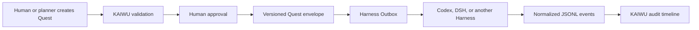

# 开物 KAIWU

> A local-first, human-approved workbench for coordinating multiple Agent Harnesses.

开物把项目、任务、知识来源、Harness 事件和执行 Quest 放在一个可审计的工作台中。规划可以来自人或 AI，但任何写入型 Quest 都必须经过人工批准，才会进入目标 Harness 的 Outbox。

[](https://github.com/e29denghy/kaiwu/actions/workflows/tests.yml)
[](LICENSE)

## Why KAIWU

Agent Harnesses are good at execution, but teams still need one place to answer:

- What is planned, active, waiting, or completed?
- Which source or Harness produced the evidence?
- Who approved a write-capable task?
- What was dispatched, retried, cancelled, or rejected?
- Can another Harness consume the same Quest without rewriting the workbench?

KAIWU keeps those decisions outside any single Harness.

## Core workflow



The core does not pretend to know unreleased vendor APIs. Harness-specific behavior lives behind adapters; the stable boundary is the versioned Inbox/Outbox protocol.

## Included in v0.1

- Laravel 13 + Inertia 3 + Vue 3 local workbench.
- Workspaces, projects, modules, tasks, steps, reminders, and daily focus.
- Optional Markdown knowledge-source synchronization.
- Harness connections with idempotent JSONL event ingestion.
- Normalized, project-linked Harness event timeline.
- Quest creation, risk metadata, constraints, verification, and acceptance criteria.
- Mandatory human approval before dispatch.
- Atomic filesystem Outbox with `kaiwu.quest/v1` envelopes.
- Append-only execution attempts for retry history.
- CLI commands for synchronization and approved dispatch.

KAIWU does **not** execute arbitrary shell commands itself in v0.1. A Harness consumes approved Outbox messages and writes normalized events back to its Inbox. This keeps the coordinator small and prevents a web request from silently gaining machine-level execution authority.

## Requirements

- PHP 8.4+
- Composer 2
- Node.js 22+
- SQLite by default; MySQL and PostgreSQL are supported by Laravel

## Quick start

```bash
git clone https://github.com/e29denghy/kaiwu.git
cd kaiwu
composer install
cp .env.example .env
touch database/database.sqlite
php artisan key:generate
php artisan migrate --seed
npm install
npm run build
php artisan serve
```

Open <http://127.0.0.1:8000>, create a Harness connection, and point it at absolute Inbox and Outbox paths.

For local development:

```bash
composer run dev
```

## Harness connection

Each connection currently uses the `jsonl` driver:

- `inbox_path`: an append-only JSONL file written by a Harness or bridge.
- `outbox_path`: a directory where KAIWU writes approved Quest envelopes.

Import events:

```bash
php artisan harness:sync
php artisan harness:sync codex-local
```

Dispatch an already-approved Quest:

```bash
php artisan quest:dispatch 12 codex-local
```

See [Harness adapter protocol](docs/harness-adapter.md) and [Quest protocol](docs/quest-protocol.md).

## DeepSeek Harness

DeepSeek Harness support is intentionally described as an adapter target, not as a completed native integration. Once its public event and execution contracts are available, a DSH adapter can translate those contracts to `kaiwu.event/v1` and `kaiwu.quest/v1` without changing KAIWU's project, approval, or audit models.

## Security model

- Local-first and single-user by default; do not expose the development server to the public internet.
- Creating a Quest does not authorize execution.
- Approval time is persisted and included in the dispatched envelope.
- Retries create new execution records and dispatch IDs.
- Inbox payloads are treated as data, never as instructions for KAIWU itself.
- Secrets do not belong in connection JSON, Quest text, examples, or the repository.

Read [SECURITY.md](SECURITY.md) before enabling bridges that can modify repositories.

## Project status

This is an early open-source extraction from a private personal workflow application. Business-specific seed data, production paths, credentials, and deployment behavior have been removed. The immediate roadmap is:

1. Adapter conformance fixtures and JSON Schema files.
2. Codex bridge reference implementation.
3. DSH adapter after the public contract is available.
4. Result confirmation and diff review UI.
5. Authentication and multi-user approval policies.

## License

Apache License 2.0. See [LICENSE](LICENSE).
