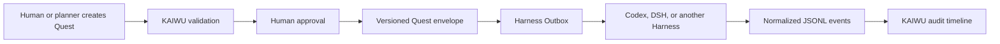

# 开物 KAIWU

> 本地优先、人工批准、跨 Agent Harness 的工作台。
>
> A local-first, human-approved workbench for coordinating multiple Agent Harnesses.

开物把项目、任务、知识来源、Harness 事件和执行 Quest 放在一个可审计的工作台中。规划可以来自人或 AI，但任何写入型 Quest 都必须经过人工批准，才会进入目标 Harness 的 Outbox。

[](https://github.com/e29denghy/kaiwu/actions/workflows/tests.yml)
[](LICENSE)

## 中文说明 | Chinese documentation

### 开物是什么

开物是一个本地优先、人工批准、跨 Agent Harness 的工作台。它负责保存项目和 Quest、记录 Harness 事件、控制人工审批、派发 Outbox 消息并保留审计历史；真正的机器执行仍由 Codex、DeepSeek Harness 或其他 Harness 完成。

### 核心工作流

```text
人或 AI 规划器创建 Quest
        ↓
开物校验 → 人工批准 → 写入 kaiwu.quest/v1 Outbox
        ↓
目标 Harness 执行 → 写入 kaiwu.event/v1 Inbox
        ↓
开物同步事件并形成审计时间线
```

写入型 Quest 没有人工批准就不能派发；重试会产生新的执行尝试，不会覆盖历史记录。

### 当前源码已包含

- Laravel 13 + Inertia 3 + Vue 3 本地工作台。
- Workspace、项目、模块、任务、步骤、提醒和每日聚焦。
- Markdown 知识来源同步。
- 幂等 JSONL Harness 事件导入和项目关联时间线。
- Quest 风险元数据、约束、验证方式和验收标准。
- 人工批准门禁、版本化 Outbox 信封和追加式重试历史。
- `harness:sync`、`quest:dispatch` 等 CLI 命令。
- `kaiwu.event/v1`、`kaiwu.quest/v1` JSON Schema、公开一致性样例和只读验证命令。
- 固定官方 Python SDK `0.1.0rc6` 与 npm headless CLI `0.1.0-rc.6` 的 DeepSeek Harness Developer Preview bridge。
- DSH `read-only` / `workspace-write` 沙箱映射、非交互权限扩大拒绝与执行状态回写。

开物 Web 应用本身不执行任意 Shell 命令。Inbox 内容只被当作数据处理，不会被当作开物自身的执行指令；DSH bridge 是由操作者独立启动的进程。

### 快速开始

```bash
git clone https://github.com/e29denghy/kaiwu.git
cd kaiwu
composer install
cp .env.example .env
touch database/database.sqlite
php artisan key:generate
php artisan migrate --seed
npm install
npm run build
php artisan serve
```

打开 <http://127.0.0.1:8000>，创建 Harness 连接，并配置绝对路径的 Inbox 和 Outbox。

### Harness 连接

当前支持通用 `jsonl` 和 `deepseek` 驱动：

- `inbox_path`：Harness 或桥接程序写入的追加式 JSONL 文件。
- `outbox_path`：开物写入已批准 Quest 信封的目录。

`deepseek` 驱动仍以同一份 JSONL Inbox/Outbox 作为稳定的开物边界，外部 bridge 负责调用 DSH SDK 或 headless CLI。这能保证 Web 应用不直接获得 Shell 权限。

```bash
php artisan harness:sync
php artisan harness:sync codex-local
php artisan harness:validate examples/conformance/valid/events.jsonl
php artisan harness:validate examples/conformance/valid/quest.json
php artisan quest:dispatch 12 codex-local
```

协议文档：

- [Harness Adapter 协议](docs/harness-adapter.md)
- [Quest 协议](docs/quest-protocol.md)
- [Event JSON Schema](schemas/kaiwu-event-v1.schema.json)
- [Quest JSON Schema](schemas/kaiwu-quest-v1.schema.json)
- [Adapter 一致性样例](examples/conformance)
- [DeepSeek Harness bridge](bridges/deepseek-harness)

### DeepSeek Harness（DSH）Developer Preview 适配

DeepSeek 已发布 `deepseek-ai/deepseek-harness`、npm CLI 和 Python SDK。开物现在包含可运行的外部 DSH bridge：它消费已批准的 `kaiwu.quest/v1` Outbox，通过固定 rc6 的官方自动化入口执行，再把启动、完成或失败结果写为 `kaiwu.event/v1` Inbox 事件。Linux 自动选择 Python SDK JSON-RPC，macOS 自动选择 npm headless CLI，因为已发布 rc6 macOS arm64 SDK wheel 缺少默认运行时必需的 `node-pty` 原生文件。

这是已实现、可测试的 Preview Adapter，但不是稳定性承诺：DeepSeek 官方仍将 DSH 标记为 Developer Preview，并明确预告会有破坏兼容性的变更。因此 bridge 固定 rc6，后续升级必须先重跑 bridge 单测、开物协议一致性测试和实际沙箱验证。

详细安装、命令、权限和恢复规则见 [DeepSeek Harness bridge 指南](bridges/deepseek-harness/README.md)。

### 安全边界

- 默认本地优先、单用户，不要把开发服务器暴露到公网。
- 创建 Quest 不等于授权执行。
- 批准时间、执行尝试和派发 ID 都会保留。
- 连接 JSON、Quest 文本、示例和仓库中不应放置密钥。

启用能够修改代码仓库的桥接程序前，请阅读 [SECURITY.md](SECURITY.md)。

### 路线图

1. ✅ Adapter 一致性测试样例、JSON Schema 和只读验证命令。
2. ✅ DSH Python SDK Developer Preview Adapter。
3. Codex bridge 参考实现。
4. 结果确认和差异审查 UI。
5. 认证与多用户审批策略。

---

## English documentation

## Why KAIWU

Agent Harnesses are good at execution, but teams still need one place to answer:

- What is planned, active, waiting, or completed?
- Which source or Harness produced the evidence?
- Who approved a write-capable task?
- What was dispatched, retried, cancelled, or rejected?
- Can another Harness consume the same Quest without rewriting the workbench?

KAIWU keeps those decisions outside any single Harness.

## Core workflow



Harness-specific behavior lives behind versioned adapters; the stable KAIWU boundary remains the versioned Inbox/Outbox protocol even when a vendor transport is still in preview.

## Included in the current source

- Laravel 13 + Inertia 3 + Vue 3 local workbench.
- Workspaces, projects, modules, tasks, steps, reminders, and daily focus.
- Optional Markdown knowledge-source synchronization.
- Harness connections with idempotent JSONL event ingestion.
- Normalized, project-linked Harness event timeline.
- Quest creation, risk metadata, constraints, verification, and acceptance criteria.
- Mandatory human approval before dispatch.
- Atomic filesystem Outbox with `kaiwu.quest/v1` envelopes.
- Append-only execution attempts for retry history.
- CLI commands for synchronization and approved dispatch.
- JSON Schema contracts, public conformance fixtures, and a read-only protocol validator.
- A runnable DeepSeek Harness Developer Preview bridge pinned to the official Python SDK `0.1.0rc6` and npm headless CLI `0.1.0-rc.6`.
- DSH read-only/workspace-write sandbox mapping, unattended escalation rejection, and execution-state projection.

The KAIWU web application does **not** execute arbitrary shell commands itself. A separately supervised Harness bridge consumes approved Outbox messages and writes normalized events back to its Inbox. This keeps the coordinator small and prevents a web request from silently gaining machine-level execution authority.

## Requirements

- PHP 8.4+
- Composer 2
- Node.js 22+
- SQLite by default; MySQL and PostgreSQL are supported by Laravel

## Quick start

```bash
git clone https://github.com/e29denghy/kaiwu.git
cd kaiwu
composer install
cp .env.example .env
touch database/database.sqlite
php artisan key:generate
php artisan migrate --seed
npm install
npm run build
php artisan serve
```

Open <http://127.0.0.1:8000>, create a Harness connection, and point it at absolute Inbox and Outbox paths.

For local development:

```bash
composer run dev
```

## Harness connection

Connections can use the generic `jsonl` driver or the `deepseek` driver:

- `inbox_path`: an append-only JSONL file written by a Harness or bridge.
- `outbox_path`: a directory where KAIWU writes approved Quest envelopes.

The `deepseek` driver keeps KAIWU's JSONL Inbox/Outbox as the stable application boundary. The external bridge owns the DSH SDK process, so the web application never gains direct shell authority.

Import events:

```bash
php artisan harness:sync
php artisan harness:sync codex-local
php artisan harness:validate examples/conformance/valid/events.jsonl
php artisan harness:validate examples/conformance/valid/quest.json
```

Dispatch an already-approved Quest:

```bash
php artisan quest:dispatch 12 codex-local
```

See [Harness adapter protocol](docs/harness-adapter.md), [Quest protocol](docs/quest-protocol.md), the [DeepSeek Harness bridge](bridges/deepseek-harness), the [Event schema](schemas/kaiwu-event-v1.schema.json), the [Quest schema](schemas/kaiwu-quest-v1.schema.json), and the public [conformance fixtures](examples/conformance).

## DeepSeek Harness Developer Preview adapter

DeepSeek has published `deepseek-ai/deepseek-harness`, its npm CLI, and a Python SDK. KAIWU now ships a runnable external bridge that consumes approved `kaiwu.quest/v1` Outbox envelopes through pinned rc6 official automation transports and writes started, completed, or failed `kaiwu.event/v1` events back to the Inbox. Auto mode selects Python SDK JSON-RPC on Linux and the npm headless CLI on macOS because the published rc6 macOS arm64 SDK wheel is missing the `node-pty` native file required by its default runtime.

This is implemented and tested preview compatibility, not a stability promise or an in-process native plugin. DeepSeek still labels DSH Developer Preview and explicitly warns of compatibility-breaking changes. The bridge therefore pins rc6; upgrades must pass the bridge tests, KAIWU conformance suite, and sandbox verification before the pin moves.

## Security model

- Local-first and single-user by default; do not expose the development server to the public internet.
- Creating a Quest does not authorize execution.
- Approval time is persisted and included in the dispatched envelope.
- Retries create new execution records and dispatch IDs.
- Inbox payloads are treated as data, never as instructions for KAIWU itself.
- Secrets do not belong in connection JSON, Quest text, examples, or the repository.

Read [SECURITY.md](SECURITY.md) before enabling bridges that can modify repositories.

## Project status

This is an early open-source extraction from a private personal workflow application. Business-specific seed data, production paths, credentials, and deployment behavior have been removed. The immediate roadmap is:

1. ✅ Adapter conformance fixtures, JSON Schema files, and a read-only validator.
2. ✅ DSH rc6 Developer Preview adapter.
3. Codex bridge reference implementation.
4. Result confirmation and diff review UI.
5. Authentication and multi-user approval policies.

## License

Apache License 2.0. See [LICENSE](LICENSE).
